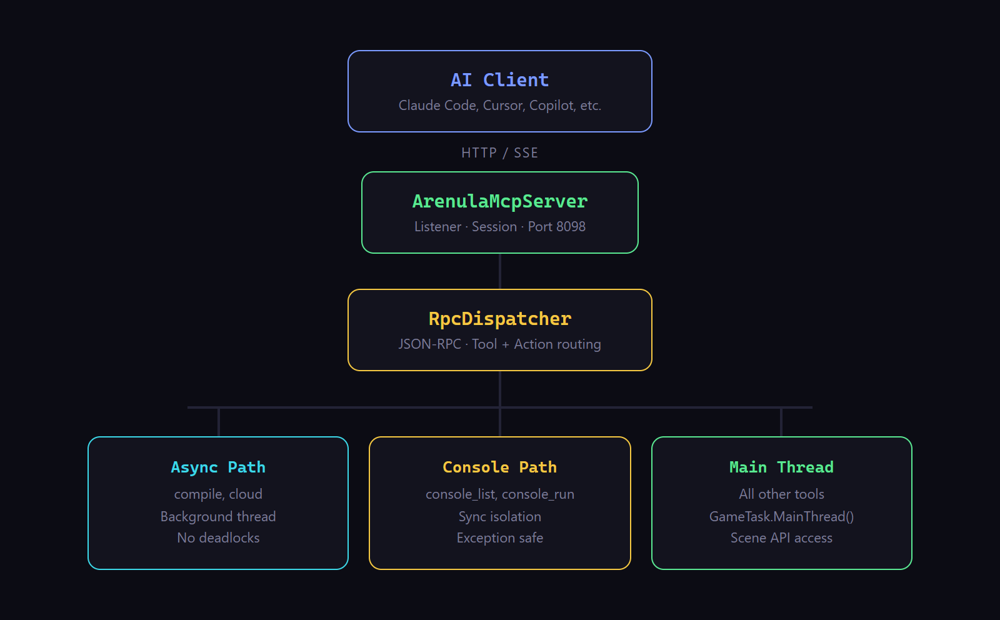

# Arenula

**[nyx000.github.io/arenula-mcp](https://nyx000.github.io/arenula-mcp/)**

MCP server suite for the [s&box](https://sbox.game) game engine. Connects AI coding assistants to the s&box editor — reading scenes, creating objects, compiling code, managing assets, and more.

Designed following [Anthropic's MCP best practices](https://www.anthropic.com/engineering/writing-tools-for-agents): omnibus tools with action enums, rich descriptions with negative guidance, trimmed responses, actionable errors.

*Arenula* — Latin for "grain of sand". One grain in the sandbox.

## Servers

| Server | What it does | Runtime | Transport |
|--------|-------------|---------|-----------|
| **Editor** | Scene manipulation, compilation, assets, terrain | C# plugin inside s&box | SSE `:8098` |
| **API** | Offline type/member reference (~1,800 types, ~15,000 members), PBR texture fetching | Node.js | stdio |
| **Docs** | Narrative docs from sbox.game (raw markdown via `.md` endpoints) | Node.js | stdio |

## Setup

### 1. Clone Arenula-MCP

Clone or download this repo somewhere on your machine. This is where the API and Docs servers will live — they don't need to be inside your s&box project.

```
C:\Projects\Arenula-MCP\       <-- can be anywhere you like
  editor/                      goes into your s&box project (step 2)
  api/                         stays here, runs from here
  docs/                        stays here, runs from here
```

### 2. Editor plugin

Copy `editor/` into your s&box project's Libraries folder:

```
YourProject/
  Libraries/
    arenula_mcp/               <-- copy the contents of editor/ here
      Editor/
        Core/
        Handlers/
      sbox_mcp.sbproj
```

Open s&box — Arenula compiles automatically and starts the MCP server on port 8098.

### 3. Build API & Docs

From the Arenula-MCP root, install and build both Node.js servers:

```bash
npm run setup        # installs dependencies and builds both servers
```

This builds `api/dist/index.js` and `docs/dist/index.js` — those are the files your AI client will point to.

### 4. Configure your AI client

Add a `.mcp.json` file to your s&box project root (or copy `.mcp.json.example`). Update the paths to where you cloned Arenula-MCP:

```json
{
  "mcpServers": {
    "editor": {
      "type": "sse",
      "url": "http://localhost:8098/sse"
    },
    "api": {
      "command": "node",
      "args": ["C:/Projects/Arenula-MCP/api/dist/index.js"],
      "env": {
        "SBOX_API_URL": "https://cdn.sbox.game/releases/..."
      }
    },
    "docs": {
      "command": "node",
      "args": ["C:/Projects/Arenula-MCP/docs/dist/index.js"]
    }
  }
}
```

Replace `C:/Projects/Arenula-MCP` with wherever you cloned the repo. Get the latest API schema URL from [sbox.game/api/schema](https://sbox.game/api/schema) (click Download, copy URL).

Tools appear as `mcp__editor__*`, `mcp__api__*`, `mcp__docs__*` in your AI client.

## Editor Tools

19 omnibus tools, ~156 actions. Each tool takes a required `action` parameter.

| Tool | Actions | Count |
|------|---------|-------|
| **scene** | summary, hierarchy, statistics, find, find_in_radius, get_details, prefab_instances | 7 |
| **gameobject** | create, destroy, duplicate, reparent, rename, enable, set_tags, set_transform, batch_transform | 9 |
| **component** | add, remove, set_property, set_enabled, get_properties, get_types, copy | 7 |
| **compile** | trigger, status, errors, generate_solution, wait | 5 |
| **prefab** | instantiate, get_structure, get_instances, break, update, create, save_overrides, revert, get_overrides | 9 |
| **asset_query** | browse, search, open, get_dependencies, get_model_info, get_material_properties, get_mesh_info, get_bounds, get_unsaved, get_status, get_json, get_references | 12 |
| **asset_manage** | create, delete, rename, move, save, reload, get_references | 7 |
| **editor** | select, get/set_selected, clear/frame_selection, play controls, save, undo/redo, console, preferences, open_code_file, get_log | 18 |
| **session** | list, set_active, load_scene | 3 |
| **lighting** | create, configure, create_skybox, set_skybox | 4 |
| **physics** | add_collider, configure_collider, add_rigidbody, create_model_physics, create_character_controller, create_joint | 6 |
| **audio** | create, configure | 2 |
| **effects** | create, configure_particle, configure_post_processing | 3 |
| **camera** | create, configure, capture_viewport, capture_tour, orbit_capture | 5 |
| **mesh** | create_block, create_plane, create_cylinder, create_wedge, create_arch, create_clutter, extrude_faces, remove_faces, add_face, clip_faces, scale_mesh, thicken_faces, bevel_edges, bevel_vertices, split_edges, quad_slice_faces, dissolve_edges, bridge_edges, connect_vertices, flip_faces, extend_edges, set_face_material, set_texture_params, vertex ops, get_info | 27 |
| **navmesh** | create_agent, create_area, create_link, generate, get_status, query_path | 6 |
| **cloud** | search, get_package, get_versions, mount | 4 |
| **project** | get_collision, set_collision_rule, get_input, get_info | 4 |
| **terrain** | create, configure, get_info, get_height, get_height_region, set_height, noise, erode, stamp, add/remove_material, get_material_at, blend_materials, set_hole, paint_material, import/export_heightmap, sync | 18 |

## Architecture

28 C# source files — 8 core infrastructure, 20 per-tool handlers.



## Attribution

- Editor based on [Ozmium MCP Server](https://github.com/ozmium7/ozmium-mcp-server-for-sbox) by ozmium7 (GPL-3.0)
- API based on [sbox-api-mcp](https://github.com/sofianebel/sbox-api-mcp) by sofianebel (MIT)
- Docs based on [sbox-docs-mcp](https://github.com/sofianebel/sbox-docs-mcp) by sofianebel (MIT)

## License

GPL-3.0 (Editor) · MIT (API, Docs)
